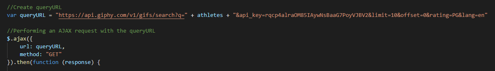

# UC Berkeley Fullstack Coding Bootcamp

# Giftastic

## Overveiw:
In this assignment, I used the GIPHY API to make a dynamic web page that populates with gifs of popular athletes. I had to call the GIPHY API and use JavaScript and jQuery to change the HTML of my site.

## How you play the game?
- When the user clicks on a button, the page grabs 10 static, non-animated gif images from the GIPHY API and place them on the page.
- When the user clicks one of the still GIPHY images, the gif will animate.
- When the user clicks the gif again, it should stop playing.
- Under every gif, displayed is its rating (PG, G). This data is provided by the GIPHY API.
- In the search area the user can type an athlete and hitthe submit button.
- It will make a new button with the new athletes name.
- Once the user clicks on the new button it will generate 10 new gifs of that athlete.

## Game in action: 

## Important code snippit: 
This particaular code generates the timer for the game.

## Currently working with:

- Html
- CSS
- JavaScript
- jQuery
- GitBash
- GitLab
- GitHub
- Timers
- API

## Assignments (works in progress):

- [Profile](https://github.com/Mamitin/Basic-portfolio/blob/master/portfolio.html)
- [Portfolio](https://github.com/Mamitin/Basic-portfolio/blob/master/portfolio.html)
- [Contact](https://github.com/Mamitin/Basic-portfolio/blob/master/contact.html)
- [Wireframe](https://github.com/Mamitin/HW-Wireframe/blob/master/index.html)
- [Bootstrap Portfolio](https://github.com/Mamitin/Bootstrap-Portfolio/blob/master/index.html)
- [Crytal Collector](https://mamitin.github.io/unit-4-game/blob/master/index.html)
- [Simpson Trivia Game](https://github.com/Mamitin/TriviaGame)
- [GifTastic]()

## Contributing
Please find me on [Linkedin](https://www.linkedin.com/in/monica-amitin-58635475/).

